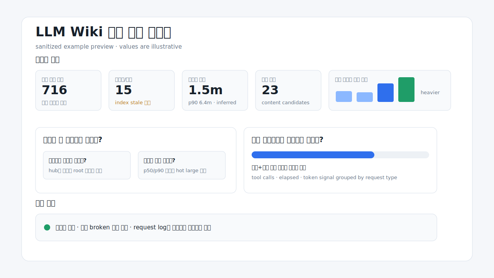

# LLM Wiki Diagnostics

LLM이 관리하거나 조회하는 위키, 지식 베이스, Obsidian 볼트의 운영 상태를 진단하기 위한 가벼운 가이드 패키지입니다. 위키가 커질수록 생기는 질문에 답하는 것이 목표입니다.

- 내 위키는 LLM이 찾기 좋은 구조인가?
- 문서, 인덱스, 로그, 그래프, 세션 기록이 잘 연결되어 있는가?
- 요청 한 번에 검색, 조회, 시간, 토큰, 도구 호출이 얼마나 드는가?
- 위키가 점점 무거워지는 중인가, 아니면 아직 버티는 중인가?

이 프로젝트는 고정된 플러그인 실행 파일이 아니라 `README + 3단계 Markdown + 예시`로 구성된 진단 가이드입니다. 사용자는 이 폴더를 Claude Code, Codex, Cursor, 로컬 LLM 같은 에이전트에게 주고, 에이전트가 자신의 환경에 맞는 임시 수집기와 HTML 리포트를 만들게 합니다.



## 이런 결과물을 만듭니다

정상적인 실행은 다음 산출물을 남깁니다.

- `source inventory`: 어떤 파일, 인덱스, 로그, 그래프, 세션/telemetry가 증거로 쓰였는지
- `intake/profile`: 현재 위키 구조와 제외 범위, 애매한 가정
- `aggregate metrics`: 문서 수, 인덱스 부담, 연결성, 활동 추세, 요청당 비용, 측정 공백
- `session/telemetry probe`: query log가 없을 때 세션 기록으로 추정한 요청당 시간, 도구 호출, 토큰 신호
- `HTML report`: 상단에는 핵심 지표와 해석, 하단에는 세부 차트와 원자료 요약
- `evaluation note`: 어떤 값이 실측이고 어떤 값이 추정인지, 다음 run에서 무엇을 개선할지

핵심 리포트는 두 질문에 답해야 합니다.

1. `위키가 잘 구축되어 있는가?`
2. `내가 효율적으로 사용하고 있는가?`

## 빠른 시작

이 저장소를 내려받은 뒤, 분석하려는 위키 경로와 함께 에이전트에게 아래처럼 요청하세요.

```text
이 디렉토리의 README와 01-03 문서를 참고해서 <target wiki>의 LLM wiki를 진단하고 HTML 리포트까지 생성해줘.
```

Obsidian 볼트 안에서 바로 실행한다면:

```text
현재 작업 디렉토리의 llm-wiki-diagnostics 가이드를 기준으로 내 Obsidian 볼트가 잘 구축되어 있고 효율적으로 사용되고 있는지 분석해줘.
```

요청별 query log가 없다면, 위키를 주로 사용한 에이전트나 세션 힌트를 같이 주세요.

```text
요청별 로그는 따로 없지만, 이 위키는 주로 <agent/runtime>의 <project-or-session>에서 조회하고 수정했어. 가능하면 해당 세션 기록을 간접 분석해서 요청당 시간, 도구 호출, 문서 조회, 토큰 추정치를 함께 리포트해줘.
```

더 좋은 입력:

- 위키 경로와 대표 진입점
- 주로 쓰는 에이전트, 앱, 프로젝트명, 세션명
- query/request log, hook log, graph/search/vector trace가 있는지
- 조회 요청만 볼지, 작성/정리/인덱싱 요청도 분리해서 볼지

## 적용 범위

현재 문서는 다음 환경을 염두에 두고 만들었습니다.

- Claude Code, Codex, Cursor, 로컬 LLM 같은 에이전트 기반 작업
- 기본 Markdown/Obsidian 위키
- PARA처럼 폴더와 하위 인덱스를 함께 쓰는 구조
- guide/index/log 중심의 LLM wiki
- Graphify, graph DB, vector index, custom search route처럼 문서 밖의 연결 경로가 있는 구조
- query log가 없지만 세션 transcript나 runtime trace를 간접 분석할 수 있는 구조

다만 모든 위키에 자동으로 정확히 맞는 제품은 아닙니다. 이 패키지는 고정 parser가 아니라 `어떤 질문을 해야 하고, 어떤 증거를 찾아야 하며, 어떤 리포트를 만들어야 하는지`를 알려주는 가이드입니다. 실제 계산식, 파서, source family, 연결 모델은 사용자의 에이전트가 환경에 맞게 조정해야 합니다.

## 관련 프로젝트와 태그

- [para-knowledge-base](https://github.com/ernestolee13/para-knowledge-base) — PARA형 Obsidian 볼트에 LLM wiki 구조, 인덱스, 로그, ingest/query/lint/index 운영 흐름을 추가하는 Claude Code 플러그인.
- `llm-wiki-diagnostics`는 그 위키가 잘 구축되어 있고 효율적으로 사용되는지 진단하는 별도 가이드 패키지입니다.

함께 관리하기 좋은 GitHub topics:

- `llm-wiki`
- `obsidian`
- `knowledge-base`
- `pkm`
- `wiki-diagnostics`
- `query-telemetry`
- `agent-observability`

## 주의사항

- 첫 run의 수치는 진단 시작점입니다. 특히 세션 기반 시간/토큰은 query log가 없으면 추정치입니다.
- stub, orphan, dead-end, broken reference는 자동 결함이 아니라 검토 후보입니다. daily note, archive, generated log, deliberate chunk는 약하게 보일 수 있습니다.
- Obsidian wikilink, frontmatter, graph edge, vector search, MCP route, Graphify export 중 무엇이 연결 모델인지는 위키마다 다릅니다.
- 개인정보가 많은 세션/로그를 분석할 수 있으므로 기본 산출물은 aggregate, path, role, hash, confidence 중심이어야 합니다.
- 예시 파일은 스타일 참고용입니다. 예시 수치, 경로, threshold를 실제 위키에 복사하면 안 됩니다.

## 피드백과 PR

다른 에이전트, 다른 위키 구조, 다른 telemetry 포맷에서 어색한 부분이 있으면 이슈나 PR을 환영합니다. 특히 다음 피드백이 유용합니다.

- 특정 환경에서 intake가 놓치는 source family
- query/request log로 남기면 좋은 최소 필드
- 더 직관적인 리포트 질문, 차트, 용어
- Graphify, graph DB, vector index, local LLM trace 적용 사례

## 실행 계약

이 패키지를 실행하는 에이전트는 대상 위키를 깊게 탐색하기 전에 먼저 작은 산출물부터 남겨야 합니다.

1. 출력 폴더를 만들고 `run manifest` 또는 `intake checkpoint`를 즉시 저장합니다.
2. 파서나 수집기를 작성하기 전에 `source inventory` 초안을 저장합니다. 처음에는 source family, 예상 역할, 점검 상태, cap, 미확인 값을 담은 skeleton이어도 됩니다.
3. 큰 파서나 수집기를 작성하기 전에 `collection checkpoint` 초안을 저장합니다. 여기에는 수집 범위, cap, source family, 어떤 값이 실측/추정/측정불가가 될지의 초기 계획을 둡니다.
4. 대상 후보가 많은 탐색 결과는 터미널에 길게 출력하지 않고 `source inventory` artifact에 업데이트합니다.
5. 수집은 큰 all-in-one 스크립트 하나보다 작은 단계별 artifact로 진행합니다: intake, source inventory, collection checkpoint, static summary, session/telemetry probe, aggregate metrics, HTML report, evaluation note.
6. 터미널 출력은 진행 상태, 개수, artifact 경로, 검증 오류만 짧게 보여줍니다. 생성한 JSON/HTML/collector 스크립트의 전체 본문이나 diff를 로그에 길게 남기지 않습니다.
7. query log가 없으면 세션/trace 후보를 찾아 임시 파서로 요청당 시간, 도구 호출, 문서 조회, 토큰 신호를 추정하되, 추정과 실측을 구분합니다.
8. 최종 prose나 HTML을 길게 작성하기 전에 `aggregate metrics` artifact를 먼저 저장하고 JSON 파싱 검증을 통과시킵니다. 그래야 report 단계가 멈춰도 수집 결과를 이어받아 재생성할 수 있습니다.
9. 최종 HTML은 두 질문에 답해야 합니다: `위키가 잘 구축되어 있는가?`, `내가 효율적으로 사용하고 있는가?`
10. 실행 런타임이 내부 diff나 command body를 로그에 남길 수 있다면, 별도의 짧은 `run summary` artifact를 남겨 사용자가 읽을 표준 요약면으로 삼습니다.

이 계약은 특정 구현 언어나 특정 에이전트용 포맷이 아닙니다. Markdown, graph DB, Graphify, vector index, Claude, Codex, Cursor, 로컬 LLM 모두에 동일하게 적용되는 실행 순서입니다.

## 실행 팁

실행 방식은 수집기 우선 모드가 기본입니다. 에이전트는 작은 로컬 수집기나 파서를 만들어 compact JSON/HTML 산출물로 정리해야 합니다. 터미널 출력이 많아지는 것 자체가 실패는 아니지만, 원문 로그, 전체 JSONL, 전체 문서 본문, 대량 파일 목록, 전체 실행 trace가 LLM 컨텍스트를 잠식해 최종 산출물 생성을 방해하면 수집 방식이 잘못된 것입니다.

정상적인 실행은 초반부터 파일 산출물을 남깁니다. 예를 들어 실행 manifest, source inventory, collection checkpoint, static summary, session/telemetry probe, aggregate metrics, HTML report, evaluation note가 순차적으로 생기는 것이 좋습니다. 분석이 오래 걸리더라도 아무 파일도 없이 터미널에만 긴 탐색 내용을 출력하는 흐름은 불완전한 실행입니다.

참고 실행 비용: 수백-천여 개 Markdown 파일과 여러 개의 LLM 세션 로그를 함께 분석하는 검증 실행에서는 약 10-16분이 걸렸고, 런타임 로그는 1-4MB 수준까지 커질 수 있었습니다. 이 숫자는 성능 목표가 아니라 규모 감각입니다. 실제 실행에서는 stage별 시작/종료 시각, 스캔 파일 수, 파싱 세션 수, 생성 artifact, 실패/중단 지점을 run summary나 evaluation note에 남기는 편이 좋습니다.

## 파일 구성

- [`README.md`](README.md): 프로젝트 개요, 사용 흐름, 개인정보 기본값, 검증 기준.
- [`01-intake-discovery.md`](01-intake-discovery.md): 위키 구조와 사용 환경을 파악하는 `구조 분석`.
- [`02-metric-collection.md`](02-metric-collection.md): 사용자 환경에 맞는 지표를 추출하는 `지표 수집`.
- [`03-report-composition.md`](03-report-composition.md): 수집된 지표를 해석하고 HTML로 보여주는 `리포트 생성`.
- [`example/`](example/): 선택적으로 참고하는 예시 자료.

핵심 문서들은 에이전트가 무엇을 이해하고, 측정하고, 설명해야 하는지를 정합니다. Claude Code, Codex, Cursor, 로컬 LLM, Obsidian, Graphify, 그래프 DB, 벡터 검색, MCP trace 같은 특정 런타임의 파싱 방식은 고정하지 않습니다. 실행하는 에이전트가 사용자의 실제 환경에 맞게 수집기와 리포트를 조정합니다.

## 핵심 질문

모든 진단은 다음 두 질문에 답해야 합니다.

1. `위키가 잘 구축되어 있는가?`
2. `내가 효율적으로 사용하고 있는가?`

최종 리포트에서는 이 넓은 질문을 더 구체적인 하위 질문으로 풀어야 합니다. 하위 질문은 환경에 맞게 바꿀 수 있지만, 상단 핵심 분석에서 각 큰 질문마다 최소 3개 정도의 질문과 짧은 답이 눈에 보여야 합니다.

`위키가 잘 구축되어 있는가?`를 평가하는 대표 하위 질문:

- 어떤 파일, 노드, 청크, 레코드가 실제 위키 객체이고 무엇이 진입점, 로그, 생성물, 세션 증거, telemetry인가?
- 가이드, 스키마/규칙, 인덱스, 로그, 검색/조회 경로가 식별 가능하고 유용한가?
- 문서나 지식 객체의 크기가 검색과 종합에 적절한가?
- 중요한 지식이 사용자의 실제 연결 모델에서 도달 가능한가?
- 추가, 수정, 이동, 아카이브, 인덱스 갱신, 유지보수 활동이 시간에 따라 보이는가?

`내가 효율적으로 사용하고 있는가?`를 평가하는 대표 하위 질문:

- 한 요청을 처리할 때 검색, 조회, 작성, 도구 호출, 객체 수, 시간, 토큰, 순위, hop이 얼마나 드는가?
- 요청량뿐 아니라 요청당 시간, 토큰, 도구 호출, 조회 객체 수가 시간에 따라 무거워지는가?
- 자주 사용되는 객체가 실제 내용인지, 시작 가이드/인덱스/로그/생성물인지 구분되는가?
- 어떤 요청 유형, 프로젝트, 경로, 누락 지표가 비용이나 실패를 만든다고 볼 수 있는가?
- 어떤 값이 실측, 추정, 불안정, 측정 불가인지 명확한가?

리포트가 처음부터 문서별 수리 목록이 되어서는 안 됩니다. 문서 크기, stub/orphan/dead-end, broken-reference 후보는 유용한 보조 증거지만, 핵심 이야기는 위키가 잘 작동하는지와 사용할수록 무거워지는지입니다.

## 좋은 진단을 만드는 질문

각 단계는 특정 지표 이름을 맞히는 것보다 아래 질문에 답할 수 있어야 합니다.

- 이 값은 사용자의 어떤 판단을 바꾸는가?
- 이 숫자의 분모는 무엇이며, 빠진 source family가 있으면 결론이 달라지는가?
- 이 결론은 실측, 세션 추정, 구조적 추정, 또는 측정 불가 중 어디에 속하는가?
- 사용자의 실제 연결 모델에서 중요한 지식이 닿고 이어지는가?
- 총량이 아니라 요청당, 시간대별, 역할별로 봐도 같은 결론인가?
- 사용자가 값에 반박하면 intake, collection, report 중 어느 단계를 다시 돌려야 하는가?

## 질문 설계에 참고한 외부 패턴

이 패키지는 특정 도구의 계산식을 그대로 가져오지 않습니다. 대신 오래된 위키/콘텐츠 운영 관행에서 반복적으로 등장하는 질문을 LLM wiki 진단용으로 번역합니다.

- MediaWiki의 maintenance special pages처럼 `lonely/orphan`, `dead-end`, `wanted/missing`, `broken redirect/reference`, `ancient pages`, `long pages`, `most linked pages`를 검토 후보로 볼 수 있는가?  
  참고: <https://www.mediawiki.org/wiki/Help:Special_pages>
- Wikipedia의 content assessment처럼 단순 문서 수가 아니라 품질, 중요도, 개선 우선순위를 함께 볼 수 있는가?  
  참고: <https://en.wikipedia.org/wiki/Wikipedia:Content_assessment>
- 콘텐츠 inventory와 audit처럼 모든 객체의 목록을 세는 것과 품질/개선 필요성을 판단하는 것을 분리했는가?  
  참고: <https://www.nngroup.com/articles/content-audits/>
- ROT 분석처럼 redundant, outdated, trivial한 콘텐츠가 쌓여 검색과 유지보수를 방해하는지 볼 수 있는가?  
  참고: <https://www.usda.gov/about-usda/policies-and-links/digital/digital-strategy/content/content-plays>
- 내부 검색 분석처럼 zero-result, fallback, query refinement, selected result 같은 신호가 있으면 사용자의 의도와 콘텐츠 gap을 볼 수 있는가?  
  참고: <https://www.algolia.com/blog/product/how-to-analyze-your-site-search-data>
- OpenTelemetry trace/span 모델처럼 한 요청의 start/end, attributes, child operations를 남기면 시간, 단계, route, token, hit/fallback을 더 엄밀히 측정할 수 있는가?  
  참고: <https://opentelemetry.io/docs/concepts/signals/traces/> 및 <https://opentelemetry.io/docs/specs/otel/overview/>
- graph/wiki 구조라면 connected component, reachable neighborhood, isolated node처럼 사용자의 연결 모델에서 도달 가능한지 볼 수 있는가?  
  참고: <https://networkx.org/documentation/stable/reference/algorithms/generated/networkx.algorithms.components.connected_components.html>

## 진단 흐름

Each stage should leave an inspectable checkpoint before the next stage depends on it. A default run can continue automatically, but intake assumptions and collection caveats should not appear only inside the final HTML.

The core Markdown files are instructions, not evidence. A validation or real run may restrict the agent to these core files as the only package guidance, but the agent should still inspect the target wiki, session sources, and telemetry candidates at a safe aggregate level. A contract-only intake that never looks at the target evidence is partial, not a successful discovery run.

In the common local self-run case, the user's own agent is diagnosing the user's own wiki. In that mode, guide memory, project memory, skill documents, routing rules, session summaries, command histories, plugin state, and user-level agent/session stores outside the wiki root are useful evidence for how the wiki is actually used. Read them when available to infer the usage model and parser scope; keep generated artifacts compact unless the user explicitly wants raw excerpts.

Do not collapse similarly named sources. A hidden folder inside the wiki root may be plugin state, project notes, or diagnostics, while a user-level store with a similar name may contain the actual request history. Treat those as separate source families and explain which one was used.

Each diagnostic run should start from the target wiki and currently discovered source families, not from old diagnostic outputs. Previous reports, validation folders, scratch JSON, or temporary collectors are derived artifacts. Use them only when the user explicitly asks for comparison or when they are inside `example/` as style references. Otherwise create a fresh output area and keep previous run artifacts out of the metric evidence.

### 1. Intake

Discover the user's wiki model before counting.

The agent should identify:

- operating components: guide/startup memory, schema/rules, entrypoints, indexes/hubs, logs/activity, retrieval routes, telemetry/session sources
- live wiki content versus generated output, archives, diagnostics, dependencies, and runtime artifacts
- connection surfaces: links, tags, folders, frontmatter, graph edges, semantic neighbors, search routes, MCP tools, or custom routes
- likely session or telemetry sources for request-level analysis
- a source inventory for non-document evidence, including rough structure, parseability, and supported metric families
- assumptions that are safe to proceed with and assumptions that need a targeted user question

The intake should identify real candidate paths, connectors, or source families from the target environment. Generic source-family examples are useful only as fallback notes; they should not replace evidence from the target wiki.

Ask only when the answer changes counting or interpretation.

Checkpoint: `wiki_intake_profile` plus a short intake note covering scope, exclusions, detected sources, assumptions, and open questions.

If a checkpoint is JSON, validate that it parses before the next stage consumes it. If the agent wants to preserve messy excerpts, put them in a Markdown note or summarize them; do not break machine-readable artifacts with unescaped raw text.

### 2. Collection

Collect concept-level metrics with clear scope and confidence.

Prefer metric families that answer user questions:

- operating component coverage
- activity and growth
- request/session usage cost
- document/object reading burden
- connection health
- trust, freshness, provenance, and schema consistency
- measurement gaps and next telemetry

Measured telemetry is preferred for request-level metrics. Useful future fields include request ID, request type, start/end/elapsed time, retrieval route, returned/selected/read/written objects, route depth or selected rank, token fields, and hit/fallback/usefulness.

When telemetry is absent but structured wiki-use sessions exist, the agent may generate a temporary environment-specific parser to infer request windows, tool calls, searches, reads, writes, objects touched, elapsed time, token signals, and caveats. Session-derived values should be labeled as inferred unless the trace explicitly measures them.

Do not confuse project/session summaries with request traces. A project log, OMC-style session summary, or status file can explain workload context, active tools, and likely parser vocabulary, but it usually cannot measure `요청당 비용` unless it contains per-turn events. For current ad-hoc diagnostics, a Claude/Codex/local-LLM style transcript or JSONL history with request IDs, timestamps, tool calls, and usage fields is often the most useful temporary source. If token fields are absent, token-like values may be estimated from text or payload size, but the report must keep those estimates separate from measured token usage.

Do not hardcode one user's filenames as rules. Local paths and source families may appear in generated artifacts because intake discovered them, but the core logic should reason from source role, structure, and parseability.

Checkpoint: aggregate metrics, session/telemetry probe result, measurement gaps, and a short collection note explaining which intake assumptions were used.

### 3. Report

Generate a Korean-first, self-contained HTML report when possible.

The report should lead with:

- a compact top area with key values and trends
- answers to the two main questions with 3-4 subquestions each
- three recommendation directions: structure/navigation, usage workflow, and telemetry/measurement

The lower area should preserve richer evidence:

- operating component inventory
- request/session analysis or a clear parser/telemetry gap
- time-window trends
- size and reading-burden views
- connection-health candidates and broken references
- trust/schema/freshness signals
- measurement gaps and diagnostic run cost

Use visuals when they clarify burden, trend, or concentration: cards, bars, timelines, sparklines, histograms, ranked bars, stacked availability views, or small route/graph views when readable. Tables are useful for exact values, but they should not be the only way the user sees growth, cost pressure, or connection problems.

Checkpoint: HTML report, optional Markdown companion, and evaluation note. The evaluation should reference intake and collection artifacts, not only the final report.

## Dialogue And Regeneration

The first run should produce a useful default report without asking about cosmetic preferences.

After the report, user questions should refine the diagnostic:

- If a count looks wrong, revisit intake scope and denominators.
- If request cost looks wrong, revisit telemetry fields, session parser scope, and request-window rules.
- If connection labels look wrong, revisit the connection surfaces before changing report wording.
- If a chart is confusing, keep the metric but improve the visual or explanation.
- If precision is insufficient, recommend the smallest query/hook/wrapper telemetry that would measure it next time.

When a metric definition or scope changes, rerun collection before regenerating the report. Do not hand-edit the final HTML as the source of truth.

## Privacy Defaults

Default outputs should be aggregate and path-based, but discovery may read richer local context when it helps infer the usage model.

Use two practical modes:

- `aggregate output`: default artifact mode. Store counts, paths, role labels, field names, examples, confidence labels, and summarized request windows.
- `local full-context discovery`: acceptable when the user's own local agent is running the diagnostic. The agent may inspect raw memories, skill files, session transcripts, and guide documents to design better parsers, then summarize what mattered in the artifacts.

Prefer:

- counts, ratios, paths, role labels, hashes, examples, and confidence labels
- summaries of request windows rather than raw prompts
- source-family labels such as static wiki, logs, session inference, telemetry, graph/search output, or user hint

Avoid printing or storing raw prompts, raw answers, full trace lines, full note bodies, credentials, API keys, personal contact data, or private calendar/task details unless the user explicitly opts in. Candidate source inspection should use field names, counts, types, hashes, path examples, and redacted summaries rather than raw line or full-body dumps. This applies to terminal/debug logs as well as final artifacts: do not inspect session candidates by dumping raw JSONL/chat lines with `cat`, `head`, `sed`, or similar commands. Use a redacting shape probe that drops or length-counts fields such as `prompt`, `answer`, `content`, `message`, `input_preview`, `output_preview`, `arguments`, `result`, `body`, and `tool_output` before printing anything.

## Generated Artifacts

A run may create derived artifacts such as:

- intake/profile summary
- aggregate metrics or concept measurements
- generated collector or temporary session parser
- session/telemetry probe result
- HTML report
- optional Markdown companion
- evaluation or self-check note

Only the README and three stage Markdown files are core. Generated collectors, reports, scripts, JSON outputs, and evaluation files are derived outputs and should not become the next baseline unless the user explicitly wants to diagnose the diagnostic package itself.

Use stage artifacts for feedback. If a user challenges the final report, identify whether the problem belongs to intake scope, metric collection, or report composition, then rerun only the affected stage and downstream stages.

## Example Folder

`example/` contains sanitized reference material only. It may show expected report shape, terminology, and artifact style, but it should not contain a full implementation or private vault/session data.

Use examples in two modes:

- `Core-only validation`: give a fresh agent only this README and the three stage Markdown files. It should still discover structure, adapt metrics, attempt relevant session/telemetry probing, and generate a useful HTML report.
- `Example-assisted validation`: after core-only validation is acceptable, provide `example/` as a style reference. The agent may use it to improve layout and explanation, but must not copy example counts, paths, thresholds, or metric availability.

## Validation Standard

A fresh run is acceptable when it produces a Korean-first HTML report that:

- answers both main questions with concrete subquestions
- shows key metrics and trends near the top
- distinguishes measured, inferred, unreliable, and unavailable values
- attempts request-level analysis through telemetry or session inference when relevant
- audits likely session/telemetry source families before declaring request-level time, token, tool, or read/write cost unavailable
- treats missing time/token/depth/hit fields as measurement gaps
- represents guide/schema/index/log/retrieval/telemetry components before deep document repair lists
- explains connection concepts such as stub, orphan, dead-end, hot weak, and broken reference as review candidates
- includes a lower evidence area rich enough for the user to challenge and regenerate the analysis

A run is not fully acceptable just because files were generated. If discovered logs, dated notes, sessions, or telemetry vanish from derived metrics, if accessible user-level session stores are ignored, or if artifact counts contradict each other, mark the run as partial and rerun the affected collection step.

Stage artifacts that are meant to be machine-readable must parse successfully. Invalid JSON, truncated HTML, or broken links between stage artifacts should be treated as stage failure, not as a cosmetic issue.

The first diagnostic should be bounded. If a source or parser keeps failing, leave a partial artifact with the failure reason, measurement gap, and next collection recommendation instead of blocking the whole report.
